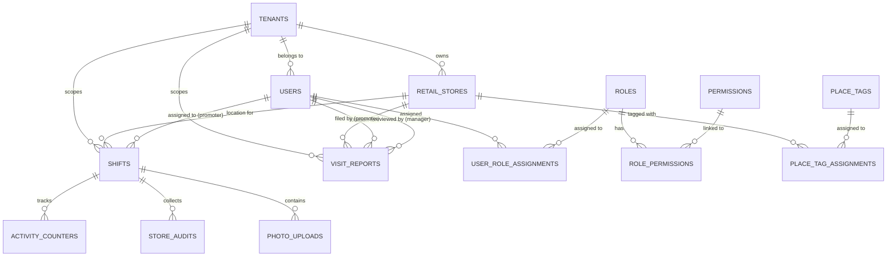

# Information Systems and Database Architecture Analysis: Promoter Pulse

## 1. Executive Summary
Promoter Pulse is an enterprise-grade multi-tenant field force management system designed for retail organizations. It enables managers to schedule shifts, track promoter attendance, and collect real-time field data (audits, photos, activity counters). The system leverages Supabase for authentication, real-time database capabilities, and row-level security (RLS) to ensure strict tenant isolation.

### Key Architecture Pillars:
- **Multi-Tenancy**: Shared database with row-level isolation via `tenant_id`.
- **Role-Based Access Control (RBAC)**: Fine-grained permissions for Admin, Manager, and Promoter roles.
- **Field Workflow**: Robust shift-based and visit-based tracking with GPS and remote check-in options.
- **Enterprise Ready**: Designed for scalability with audit logging, soft deletes, and extensible role models.

---

## 2. Technical Architecture Summary

### Stack:
- **Frontend**: Next.js (App Router)
- **Backend**: Supabase (PostgreSQL, Auth, Storage)
- **Security**: PostgreSQL Row Level Security (RLS) & Supabase Middleware
- **Deployment**: Likely Vercel/Supabase Cloud

### Architecture Pattern:
The system follows a **Feature-Sliced Design** (FSD) influenced approach, organizing code into `features` (Attendance, Auth, Places) and `core` services.

---

## 3. Database Documentation (Phase 1 & 2)

### 3.1 Entity Relationship Diagram (ERD)

### 3.2 Table Catalog

| Table | Purpose | Domain | Audit/Soft Delete |
| :--- | :--- | :--- | :--- |
| `tenants` | Root entity for organizations. | Multi-tenancy | Soft Delete |
| `users` | Application user profiles linked to Auth providers. | Identity | Soft Delete |
| `roles` | Static role definitions (Admin, Manager, Promoter). | Auth/RBAC | N/A |
| `permissions` | Static permission catalog. | Auth/RBAC | N/A |
| `user_role_assignments` | Maps users to roles within a tenant. | Auth/RBAC | N/A |
| `retail_stores` | Master data for store locations ("Places"). | Master Data | Soft Delete |
| `shifts` | Scheduled work units for promoters at stores. | Operations | Soft Delete |
| `visit_reports` | Ad-hoc or remote visit documentation. | Operations | Soft Delete |
| `activity_counters` | Quantitative metrics (e.g., footfall, sales). | Field Data | N/A |
| `store_audits` | Qualitative surveys/forms filled in field. | Field Data | N/A |
| `photo_uploads` | Evidence and merchandising photos. | Field Data | Soft Delete |
| `audit_logs` | System-wide security and admin audit trail. | Governance | N/A |

### 3.3 Relationship Analysis

- **Tenant Isolation**: Every table except `roles`, `permissions`, and `place_tags` has a `tenant_id` foreign key. This is the primary boundary for data access.
- **Shift Lifecycle**: A `Shift` acts as a parent for `activity_counters`, `store_audits`, and `photo_uploads`. This ensures all data collected in the field is context-linked to a specific time and place.
- **Role Inheritance**: Permissions are not assigned to users directly but via roles. `user_role_assignments` is a ternary relationship between `user`, `role`, and `tenant`, allowing a user to potentially have different roles in different tenants (though current implementation seems to favor one tenant per user).

---

## 4. Information Systems Analysis (Phase 3)

### 4.1 System Modules
1.  **Identity & Access (IAM)**: Manages authentication, tenant onboarding (invite-only), and RBAC.
2.  **Location Management (Places)**: Manages retail store master data, geo-fencing, and store attributes.
3.  **Operations (Shifts/Visits)**: Scheduling and execution of field work. Supports both GPS-verified shifts and remote visit reports.
4.  **Field Intelligence**: Data collection engine (Forms, Photos, Counters).
5.  **Analytics & Reporting**: Aggregation of field data for management review.

### 4.2 Data Flows (Level 0 DFD)
- **Admin/Manager** -> **Input**: Store Data, Shift Schedules, User Invites.
- **Promoter** -> **Input**: Check-in/out, Audit Answers, Photos, Sales Counters.
- **System** -> **Output**: Real-time dashboards, Shift compliance reports, Field visit summaries.

### 4.3 Sequence Flow: Shift Execution
1.  **Promoter** requests `shifts` for today.
2.  **Promoter** performs `check-in` (GPS coords sent to Supabase).
3.  **Supabase** validates tenant consistency and role.
4.  During shift, **Promoter** sends `activity_counters` and `store_audits`.
5.  **Promoter** performs `check-out`.
6.  **System** marks shift as `checked_out`.

---

## 5. Domain Modeling (Phase 4)

- **Aggregate Root: Tenant**: Owns all users, stores, and operations.
- **Aggregate Root: Shift**: Owns the lifecycle of field data collection during a specific window.
- **Domain Dependencies**: `Operations` depends on `Places` (for locations) and `IAM` (for actor context).

---

## 6. Auth + Multi-Tenancy (Phase 5)

### Supabase Integration
- **Auth Trigger**: `on_auth_user_created` trigger automatically provisions a `public.users` record and assigns the 'promoter' role by default.
- **Invite-Only Flow**: The trigger requires `tenant_id` in the `raw_user_metadata`, enforcing that users must be invited by an admin who sets their tenant context.
- **RLS Strategy**: 
    - `current_app_tenant_id()` function retrieves the tenant context from the session user.
    - Policies enforce `tenant_id = current_app_tenant_id()` for all SELECT/INSERT/UPDATE/DELETE.

### Security Assessment
- **Scalability**: The use of UUIDs and proper indexing on `tenant_id` ensures the database remains performant as more tenants are added.
- **Enterprise-Safe**: Audit logs and RLS provide strong security guarantees suitable for retail organizations with strict compliance needs.

---

## 7. Risks, Problems, and Suggested Improvements (Phase 6)

### Risks:
- **Missing Constraints**: `visit_reports` uses a check constraint for status instead of a formal `visit_status` table/enum (though an enum exists for shifts).
- **Inferred Relationships**: Some junction tables like `place_company_assignments` seem redundant if `retail_stores` already has a `tenant_id`. This might indicate a legacy structure or a future "one store, many tenants" requirement.

### Improvements:
- **Normalization**: Consider moving `form_answers` in `visit_reports` to a structured `audit_answers` table if complex reporting is needed.
- **Indexes**: Ensure `deleted_at` is included in partial indexes to speed up "active-only" queries.
- **Future Extensibility**: The `auth_provider` enum allows for easy migration to Okta or Auth0 by simply updating the `users` table and middleware.

---
*End of Documentation*
